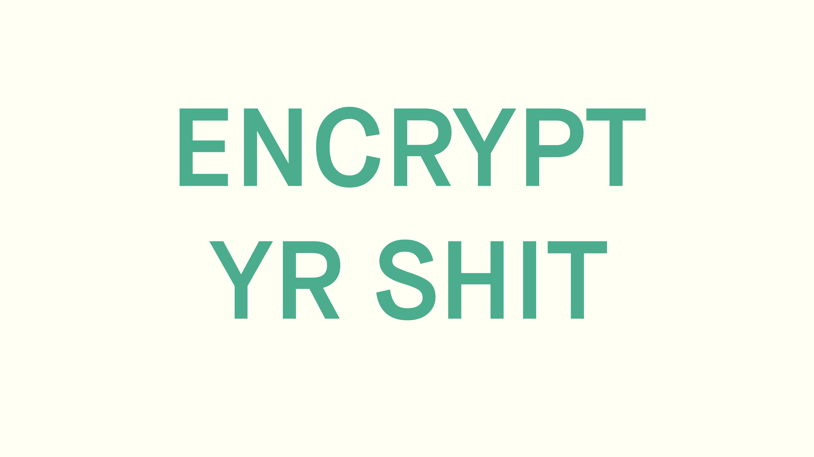

  
  

    <h1>FREE FRESH DAILY PROXY LIST</h1>
    <h3>Updated Multiple times per Day</h3>
    <a href="https://raw.githubusercontent.com/hendrikbgr/Free-Proxy-Repo/master/proxy_list.txt" target="_blank">-> Download Now <-</a>
  

# 🔥 Version 0.0.3 🔥

This is the first version of my fully automated github repo & proxy scraper. My proxy scraper & checker is running on my local raspberry pi 4+ and is updating the proxy list once scraped and checked. After that it will restart the whole progress.

My script crawls over 60+ Websites and more then 270+ urls and finds all public proxies available. All proxies are checked before they get updated here.

# Proxy Scraper & Checker

  You can find the Porxy Scrapers repo here [Proxy-Scraper](https://github.com/hendrikbgr/Proxy-Scraper)

🚀 Automate your Proxy Scraping 🚀

📌 Ver. 0.0.3 📌

## Features

* Scrape all public proxies from preset urls
* Scrape all links from the preset urls
    * Scrape all public proxies from there
* Save all scraped proxies to file
* Remove Duplicate Proxies
* Check all Proxies and save them to file
    * checked on www.google.com

### Support 👨‍💻

#### Email 📩

Any problems with running the script and any questions please cantact me via Twitter [@hendrik_bgr](https://twitter.com/Hendrik_bgr)

Or via email under [hendriksdevmail@gmail.com](mailto:hendriskdevmail@gmail.com)

